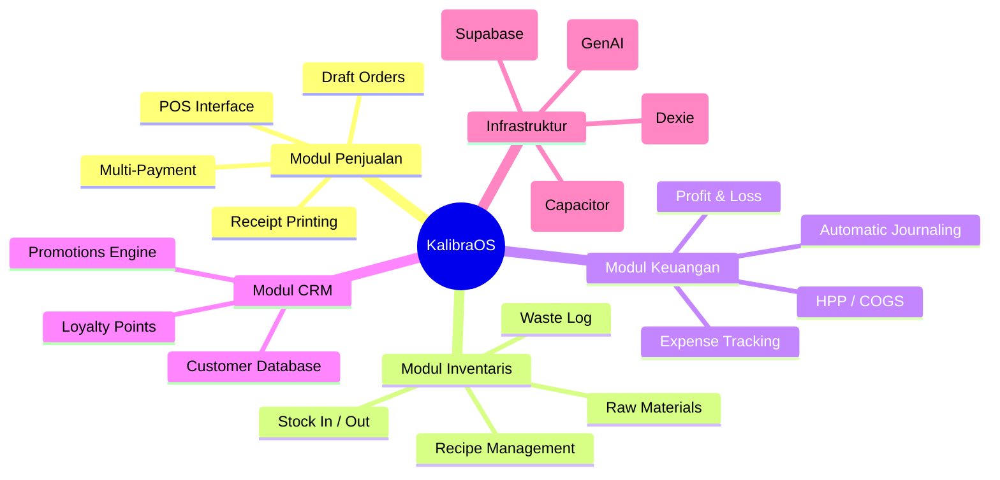

# Laporan Audit Proyek: KalibraOS

## 1. Ringkasan Eksekutif
**KalibraOS** adalah platform SaaS (*Software-as-a-Service*) multi-tenant yang dirancang khusus untuk industri *Food & Beverage* (F&B). Sistem ini berfungsi sebagai "Sistem Operasi Bisnis" yang mengintegrasikan penjualan, stok, keuangan, dan CRM ke dalam satu platform modern.

Fitur unggulan utamanya adalah arsitektur **Offline-First**, yang menjamin operasional bisnis (terutama kasir) tetap berjalan 100% lancar meskipun koneksi internet terputus.

---

## 2. Statistik Proyek
Berdasarkan audit teknis pada struktur kode `src/app`:

*   **Total Halaman Utama**: ±90 Halaman (termasuk dashboard, pengaturan, dan modul detail).
*   **Total Modul Inti**: 15 Modul.
*   **Total Fitur Utama**: >40 Fitur fungsional.

---

## 3. Modul & Fitur Detail

### A. Modul Penjualan (POS)
*   **Kasir Cepat**: Antarmuka yang dioptimalkan untuk kecepatan transaksi.
*   **Manajemen Draft (Pesanan Tunda)**: Simpan pesanan meja yang belum selesai.
*   **Multi-Pembayaran**: Tunai, QRIS, Kartu, dan E-Wallet.
*   **Void & Refund**: Pembatalan item dengan otorisasi dan pencatatan log.

### B. Modul Inventaris & Stok
*   **Manajemen Bahan Baku**: Pelacakan stok material hingga level gram/ml.
*   **Resep (Deduction)**: Stok bahan baku berkurang otomatis berdasarkan resep setiap kali produk terjual.
*   **FIFO Batching**: Pelacakan stok berdasarkan batch masuk untuk perhitungan HPP yang akurat.
*   **Stock Opname**: Fitur rekonsiliasi stok fisik vs sistem.
*   **Waste Log**: Pencatatan bahan yang rusak atau dibuang.

### C. Modul Keuangan & Akuntansi
*   **Jurnal Otomatis**: Setiap transaksi (penjualan/pembelian) langsung menjurnal ke buku besar.
*   **Manajemen Biaya (Expenses)**: Catat pengeluaran operasional dengan bukti foto.
*   **Laporan Laba Rugi**: Analisis profitabilitas real-time.
*   **HPP Rata-rata Tertimbang (WAC)**: Kalkulasi harga pokok penjualan yang dinamis.

### D. Modul CRM & Promosi
*   **Database Pelanggan**: Riwayat belanja dan profil pelanggan.
*   **Loyalty Points**: Program poin untuk meningkatkan retensi pelanggan.
*   **Promosi Engine**: Diskon persentase, nominal, dan promo BOGO (*Buy One Get One*).

### E. Modul Kecerdasan Buatan (AI)
*   **AI Promotion Generator**: Membuat ide kampanye marketing otomatis.
*   **AI Image Generator**: Membuat gambar produk dari deskripsi teks.

### F. Manajemen Mobile & Platform
*   **Dukungan Mobile (Capacitor)**: Aplikasi dapat di-build menjadi APK Android/iOS.
*   **Multi-Branch**: Kelola banyak cabang/outlet dari satu akun pemilik.
*   **Role-Based Access (RBAC)**: Pembatasan akses Kasir, Manajer, dan Owner.

---

## 4. Hubungan Antar Modul (Mindmap)

Berikut adalah visualisasi bagaimana setiap modul saling berinteraksi:

### Penjelasan Konektivitas:
1.  **POS -> Inventaris**: Saat POS menjual produk, resep memicu pengurangan stok di modul Inventaris.
2.  **POS/Inventaris -> Keuangan**: Setiap transaksi menghasilkan entri jurnal otomatis di modul Keuangan.
3.  **POS -> CRM**: Penjualan dapat dihubungkan ke data Pelanggan untuk menghitung Poin Loyalitas.
4.  **Promosi -> POS**: Aturan promosi yang dibuat di modul Promosi akan langsung memotong harga di layar Kasir.
5.  **Offline Sync**: Menjadi "jembatan" yang memastikan semua data di atas tetap sinkron antara database lokal (browser) dan server pusat.

---

## 5. Arsitektur Teknis
*   **Frontend**: Next.js 15, Tailwind CSS, Shadcn/UI.
*   **Database**: Supabase (Cloud) & Dexie.js/IndexedDB (Local).
*   **Sinkronisasi**: Service Worker dengan Background Sync API.
*   **AI**: Firebase Genkit & Google Gemini API.

---
*Dokumen ini diperbarui pada 11 Maret 2026 sebagai panduan struktur proyek KalibraOS.*
